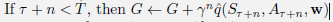
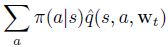

# Chapter 10

### Exercise 10.1

We have not explicitly considered or given pseudocode for any Monte Carlo
methods or in this chapter. What would they be like? Why is it reasonable not to give
pseudocode for them? How would they perform on the Mountain Car task?

#### Answer

There is no approximation in Monte Carlo methods because with MC methods we know exactly what episode reward is (MC method ends with episode end).

### Exercise 10.2

Give pseudocode for semi-gradient one-step Expected Sarsa for control.

#### Answer

In third line from the bottom of Sarsa pseudocode:

we need to replace last term of q with:

### Exercise 10.3

Why do the results shown in Figure 10.4 have higher standard errors at
large n than at small n?

#### Answer 

Small change in 𝛂 value is multiplied by n??

### Exercise 10.4

Give pseudocode for a differential version of semi-gradient Q-learning.

#### Answer

TODO

### Exercise 10.5

What equations are needed (beyond 10.10) to specify the differential
version of TD(0)?

#### Answer 

There we need equation for vector w update like in 10.12 but for state-valueintead of action-value.

### Exercise 10.6

Consider a Markov reward process consisting of a ring of three states A, B,
and C, with state transitions going deterministically around the ring. A reward of +1 is
received upon arrival in A and otherwise the reward is 0. What are the diferential values
of the three states?

#### Answer

