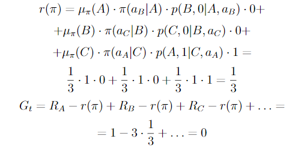
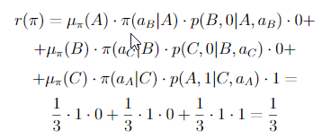

# Chapter 10

### Exercise 10.1

We have not explicitly considered or given pseudocode for any Monte Carlo
methods or in this chapter. What would they be like? Why is it reasonable not to give
pseudocode for them? How would they perform on the Mountain Car task?

#### Answer

There is no approximation in Monte Carlo methods because with MC methods we know exactly what episode reward is (MC method ends with episode end).

### Exercise 10.2

Give pseudocode for semi-gradient one-step Expected Sarsa for control.

#### Answer

In third line from the bottom of Sarsa pseudocode:

we need to replace last term of q with:

### Exercise 10.3

Why do the results shown in Figure 10.4 have higher standard errors at
large n than at small n?

#### Answer 

Small change in 𝛂 value is multiplied by n??

### Exercise 10.4

Give pseudocode for a differential version of semi-gradient Q-learning.

#### Answer

TODO

### Exercise 10.5

What equations are needed (beyond 10.10) to specify the differential
version of TD(0)?

#### Answer 

There we need equation for vector w update like in 10.12 but for state-valueintead of action-value.

### Exercise 10.6

Consider a Markov reward process consisting of a ring of three states A, B,
and C, with state transitions going deterministically around the ring. A reward of +1 is
received upon arrival in A and otherwise the reward is 0. What are the diferential values
of the three states?

#### Answer

Differential value fore each state is 0.

### Exercise 10.7

Suppose there is an MDP that under any policy produces the deterministic
sequence of rewards +1, 0, +1, 0, +1, 0, ... going on forever. Technically, this is not allowed
because it violates ergodicity; there is no stationary limiting distribution μ and the limit
(10.7) does not exist. Nevertheless, the average reward (10.6) is well defined; What is
it? Now consider two states in this MDP. From A, the reward sequence is exactly as
described above, starting with a +1, whereas, from B, the reward sequence starts with
a 0 and then continues with +1, 0, +1, 0, ... . The differential return (10.9) is not well
defined for this case as the limit does not exist. To repair this, one could alternately
define the value of a state as

Under this definition, what are the values of states A and B?

#### Answer

r(π) = 0.5

Values of A and B are undefined (as it jumps from 0 to 0.5 or from -0.5 to 0 all the time)??

### Exercise 10.8

The pseudocode in the box on page 251 updates ¯Rt using (ẟt as an error
rather than simply Rt+1 − ¯Rt. Both errors work, but using (ẟt is better. To see why,
consider the ring MRP of three states from Exercise 10.6. The estimate of the average
reward should tend towards its true value of 1/3. Suppose it was already there and was held stuck there. What would the sequence of Rt+1 − Rt errors be? What would the
sequence of (ẟt errors be (using (10.10))? Which error sequence would produce a more
stable estimate of the average reward if the estimate were allowed to change in response
to the errors? Why?

#### Answer

Rt+1 - ¯Rt sequence would be: 1/3, 1/4, 1/5, 1/3, 1/4, 1/5, ...
with ẟt it would be: 1/3, 1/4, 1/5, 1/3, 2/7, 2/8, 1/3, 3/10, 3/11, 1/3, 4/13, 4/14, 1/3, ...

