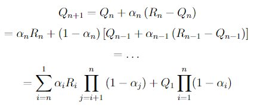
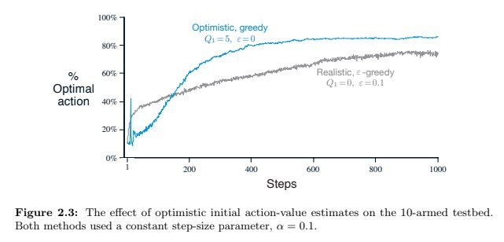
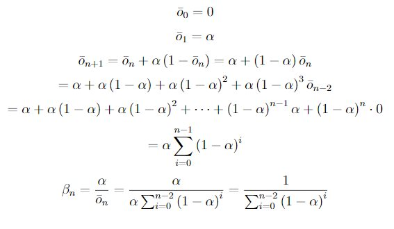
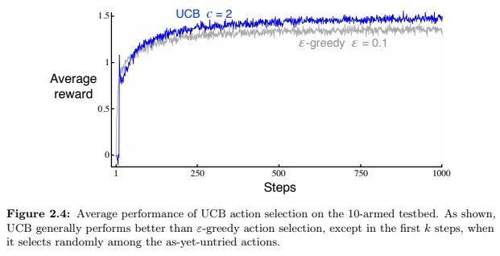
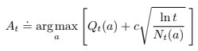
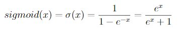

# Chapter 2

### Exercise 2.1
In ε-greedy action selection, for the case of two actions and ε = 0.5, what is
the probability that the greedy action is selected?
#### Answer
Greedy action will be seleted with probability equals 50%.

### Exercise 2.2
*Bandit example* Consider a k-armed bandit problem with k = 4 actions,
denoted 1, 2, 3, and 4. Consider applying to this problem a bandit algorithm using
ε-greedy action selection, sample-average action-value estimates, and initial estimates
of Q1(a) = 0, for all a. Suppose the initial sequence of actions and rewards is *A1 = 1,
R1 = 1, A2 = 2, R2 = 1, A3 = 2, R3 = 2, A4 = 2, R4 = 2, A5 = 3, R5 = 0*. On some
of these time steps the ε case may have occurred, causing an action to be selected at
random. On which time steps did this definitely occur? On which time steps could this
possibly have occurred?
#### Answer
ε case occured in steps: 2, 5
ε case might occured in steps 1 (depends on algoritm because every action has the same value and we don't know how it is broken).

### Exercise 2.3
In the comparison shown in Figure 2.2 , 

which method will perform best in
the long run in terms of cumulative reward and probability of selecting the best action?
How much better will it be? Express your answer quantitatively.
#### Answer
Winner would be red one (ε = 0.01) because it converges to 1 - ε = 0.99. It is 0.09 greater than blue one (ε = 0.1) which converges to 1 - ε = 0.9.

### Exercise 2.4
If the step-size parameters, , are not constant, then the estimate  is a weighted average of previously received rewards with a weighting different from that given by (2.6). What is the weighting on each prior reward for the general case, analogous to (2.6), in terms of the sequence of step-size parameters?
#### Answer


*latex:*

```
Q_{n+1} 
= Q_{n} + \alpha_{n}\left(R_{n} - Q_{n}\right)
= \alpha_{n}R_{n} + \left(1-\alpha_{n}\right)\left[Q_{n-1} + \alpha_{n-1}\left(R_{n-1} - Q_{n-1}\right)\right] 
= \ldots 
= \sum_{i=n}^{1}\alpha_{i}R_{i}\prod_{j=i+1}^{n}\left(1 - \alpha_{j}\right) + Q_{1}\prod_{i=1}^{n}(1-\alpha_{i})
```


### Exercise 2.5
skipping - programming excercise


### Exercise 2.6
*Mysterious Spikes*  

The results shown in Figure 2.3 should be quite reliable
because they are averages over 2000 individual, randomly chosen 10-armed bandit tasks.
Why, then, are there oscillations and spikes in the early part of the curve for the optimistic
method? In other words, what might make this method perform particularly better or
worse, on average, on particular early steps?
#### Answer
Used algorithm is greedy so after few starting steps every action would be performed when optimistic value is higher than real optimal value (after every choose of action the value should be lower). The smaller step size parameter α is the more steps are required to lower optimistic action value to more real action value.

After any action value is lower than action value with high real action value (it can be optimal action or action with value near to optimal) the algorithm stick to that action during many steps. It can be also action value just occasionaly high and after few episodes the real value for that action will reveal and value should change to low enough to get to another action as best one.

### Exercise 2.7
*Unbiased Constant-Step-Size Trick* In most of this chapter we have used
sample averages to estimate action values because sample averages do not produce the
initial bias that constant step sizes do (see the analysis leading to (2.6)). However, sample
averages are not a completely satisfactory solution because they may perform poorly
on nonstationary problems. Is it possible to avoid the bias of constant step sizes while
retaining their advantages on nonstationary problems? One way is to use a step size of
n

to process the n-th reward for a particular action, where α > 0 is a conventional constant
step size, and  ̄on is a trace of one that starts at 0:
Carry out an analysis like that in (2.6) to show that Qn is an exponential recency-weighted
average without initial bias.

#### Answer



*latex:*

```
\bar{o}_{0} = 0
\bar{o}_{1} = \alpha
\bar{o}_{n+1} = \bar{o}_{n} + \alpha \left(1 - \bar{o}_{n}\right) = \alpha - \left(1 - \alpha\right)\bar{o}_{n}    
= \alpha + \alpha\left(1 - \alpha\right) + \alpha\left(1 - \alpha\right)^{2} + \alpha\left(1 - \alpha\right)^{3}\bar{o}_{n-2}
= \alpha + \alpha\left(1 - \alpha\right) + \alpha\left(1 - \alpha\right)^{2} + \cdots + \left(1 - \alpha\right)^{n-1}\alpha + \left(1 - \alpha\right)^{n}\cdot0
= \alpha\sum_{i=0}^{n-1}\left(1 - \alpha\right)^{i}
\beta_{n} = \frac{\alpha}{\bar{o}_{n}} = \frac{\alpha}{\alpha\sum_{i=0}^{n-2}\left(1 - \alpha\right)^{i}} = \frac{1}{\sum_{i=0}^{n-2}\left(1 - \alpha\right)^{i}}
```
### Exercise 2.8


*UCB Spikes* In Figure 2.4 the UCB algorithm shows a distinct spike
in performance on the 11th step. Why is this? Note that for your answer to be fully
satisfactory it must explain both why the reward increases on the 11th step and why it
decreases on the subsequent steps. Hint: if c = 1, then the spike is less prominent.

#### Answer


At the beginning all actions are considered as maximizing actions (if Nt(a) = 0, then a is considered to be a maximizing action). It takes 10 steps to perform each action exactly one. After that first round each action has the same level of confidence (~3.035) which is bigger than reward. UCB algoritm is forced to explore other actions than the one with the highest reward.

### Exercise 2.9

Show that in the case of two actions, the soft-max distribution is the same
as that given by the logistic, or sigmoid, function often used in statistics and artificial
neural networks.

#### Answer



let assume that c = -b
then we have

,
and 0.9 and 0.8 with probability 0.5 (case B). If you are not able to tell which case you
face at any step, what is the best expectation of success you can achieve and how should
you behave to achieve it? Now suppose that on each step you are told whether you are
facing case A or case B (although you still don’t know the true action values). This is an
associative search task. What is the best expectation of success you can achieve in this
task, and how should you behave to achieve it?

#### Answer

*latex:*

```
\def\arraystretch{2}
\begin{tabular}{c|cc|c}
 \hline
 case & arm 1 & arm 2 & prob \\
 \hline
 A & 0.1 & 0.2 & $\frac{1}{2}$ \\
 B & 0.9 & 0.8 & $\frac{1}{2}$ \\
 \hline
\end{tabular}
```
