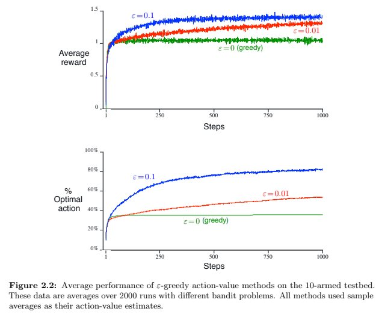

# Chapter 2

### Excercise 2.1
In ε-greedy action selection, for the case of two actions and ε = 0.5, what is
the probability that the greedy action is selected?
#### Answer
Greedy action will be seleted with probability equals 50%.

### Excercise 2.2
*Bandit example* Consider a k-armed bandit problem with k = 4 actions,
denoted 1, 2, 3, and 4. Consider applying to this problem a bandit algorithm using
ε-greedy action selection, sample-average action-value estimates, and initial estimates
of Q1(a) = 0, for all a. Suppose the initial sequence of actions and rewards is *A1 = 1,
R1 = 1, A2 = 2, R2 = 1, A3 = 2, R3 = 2, A4 = 2, R4 = 2, A5 = 3, R5 = 0*. On some
of these time steps the ε case may have occurred, causing an action to be selected at
random. On which time steps did this definitely occur? On which time steps could this
possibly have occurred?
#### Answer
ε case occured in steps: 2, 5
ε case might occured in steps 1 (depends on algoritm because every action has the same value and we don't know how it is broken).

### Excercise 2.3
In the comparison shown in Figure 2.2 , 

which method will perform best in
the long run in terms of cumulative reward and probability of selecting the best action?
How much better will it be? Express your answer quantitatively.
#### Answer
Winner would be red one (ε = 0.01) because it converges to 1 - ε = 0.99. It is 0.09 greater than blue one (ε = 0.1) which converges to 1 - ε = 0.9.
