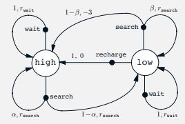
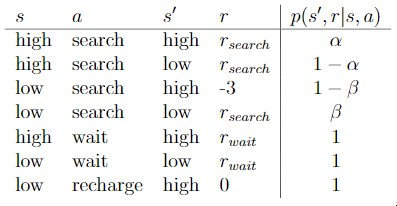
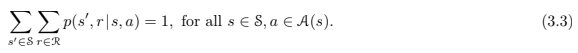
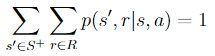
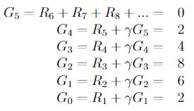
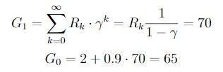
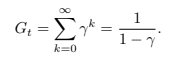
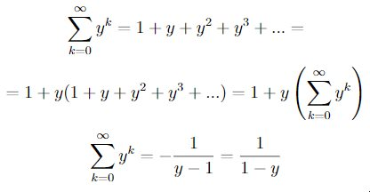
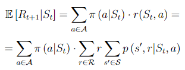

# Chapter 3

### Exercise 3.1
Devise three example tasks of your own that fit into the MDP framework,
identifying for each its states, actions, and rewards. Make the three examples as different
from each other as possible. The framework is abstract and flexible and can be applied in
many different ways. Stretch its limits in some way in at least one of your examples.
#### Answer 
1. **Chess AI**  
  Algorithm can learn which is the next best move to play to maximize reward which is +1 for a win, 0 for a draw, -1 for a lose.  
  State is combined from every piece position.
2. **Automatic traffic lights coordinator**  
  Reward could be number of cars staying in front of traffic lights.  
  State is number of cars staying in front of each traffic light separately.  
  Action is increasing or decreasing green light time in each of traffic light.
3. **Stock prediction**  
  Reward (cost) is MAE (mean absolute error) between predicted and real stock price.  
  State is a history of stock price for some time (ex. 2 months to the past).  
  Action can be increase/decrease predicted stock price.

### Exercise 3.2
Is the MDP framework adequate to usefully represent all goal-directed
learning tasks? Can you think of any clear exceptions?
#### Answer
One exception I can think about is model with infinite states space.

### Exercise 3.3
Consider the problem of driving. You could define the actions in terms of
the accelerator, steering wheel, and brake, that is, where your body meets the machine.
Or you could define them farther out—say, where the rubber meets the road, considering
your actions to be tire torques. Or you could define them farther in—say, where your
brain meets your body, the actions being muscle twitches to control your limbs. Or you
could go to a really high level and say that your actions are your choices of where to drive.
What is the right level, the right place to draw the line between agent and environment?
On what basis is one location of the line to be preferred over another? Is there any
fundamental reason for preferring one location over another, or is it a free choice?
#### Answer
Choice where the agent has the most control over state through his action seems to be the most accurate.

### Exercise 3.4
Give a table analogous to that in Example 3.3, but for p(s0, r|s, a). It should have columns for s, a, s0, r, and p(s0, r|s, a), and a row for every 4-tuple for which p(s0, r|s, a) > 0.



#### Answer 


### Exercise 3.5
The equations in Section 3.1 are for the continuing case and need to be
modified (very slightly) to apply to episodic tasks. Show that you know the modifications
needed by giving the modified version of equation (3.3).



#### Answer
For episodic tasks we should get next state not from set of nonterminal states but from set of all states.



### Exercise 3.6
Suppose you treated pole-balancing as an episodic task but also used
discounting, with all rewards zero except for -1 upon failure. What then would the
return be at each time? How does this return differ from that in the discounted, continuing
formulation of this task?

#### Answer
For a episodic discounted task return would be -γ^{T-1} where T is number of steps in each episode

### Exercise 3.7
Imagine that you are designing a robot to run a maze. You decide to give it a
reward of +1 for escaping from the maze and a reward of zero at all other times. The task
seems to break down naturally into episodes—the successive runs through the maze—so
you decide to treat it as an episodic task, where the goal is to maximize expected total
reward (3.7). After running the learning agent for a while, you find that it is showing
no improvement in escaping from the maze. What is going wrong? Have you effectively
communicated to the agent what you want it to achieve?

#### Answer 
There is no discounting so the reward is the same, no matter how quickly agent escape from a maze.
For the agent there is no difference between quick and long escape.

### Exercise 3.8
Suppose γ = 0.5 and the following sequence of rewards is received R1 = 1, R2 = 2, R3 = 6, R4 = 3, and R5 = 2, with T = 5. What are G0, G1, ..., G5? *Hint: Work backwards.*

#### Answer


### Exercise 3.9
Suppose γ = 0.9 and the reward sequence is R1 = 2 followed by an infinite
sequence of 7s. What are G1 and G0?

#### Answer


### Exercise 3.10
Prove the second equality in (3.10).



#### Answer



*latex:*
```
\sum_{k=0}^{\infty} y^k = 1 + y + y^2 + y^3 + ... =     
= 1 + y(1 + y + y^2 + y^3 + ...) = 1 + y\left(\sum_{k=0}^{\infty} y^k\right)    
\sum_{k=0}^{\infty} y^k = - \frac{1}{y-1} = \frac{1}{1-y}   
```

### Exercise 3.11
If the current state is St, and actions are selected according to stochastic
policy π, then what is the expectation of Rt+1 in terms of π and the four-argument
function p (3.2)?

#### Answer



*latext:*

```
\mathbb{E}\left[R_{t+1} \middle|S_{t}\right] = \sum_{a \in \mathcal{A}} \pi\left(a \middle| S_t\right) \cdot r(S_t, a) =
= \sum_{a \in \mathcal{A}} \pi\left(a \middle| S_t\right) \cdot \sum_{r \in \mathcal{R}} r \sum_{s' \in \mathcal{S}} p\left(s', r \middle| S_t, a\right)
```
