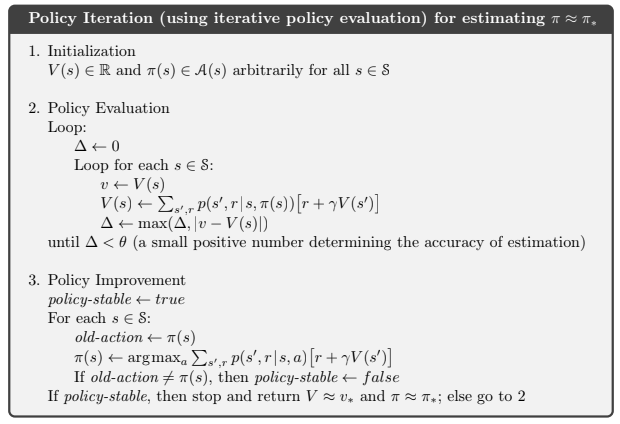
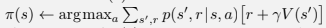

# Chapter 4

### Exercise 4.1

In Example 4.1, if π is the equiprobable random policy, what is qπ(11, down)?
What is qπ(7, down)?

#### Answer

qπ(11, down) = r = -1
qπ(7, down) = r + vπ(11) = -1 - 14 = -15

### Exercise 4.2

In Example 4.1, suppose a new state 15 is added to the gridworld just below
state 13, and its actions, left, up, right, and down, take the agent to states 12, 13, 14,
and 15, respectively. Assume that the transitions from the original states are unchanged.
What, then, is vπ(15) for the equiprobable random policy? Now suppose the dynamics of
state 13 are also changed, such that action down from state 13 takes the agent to the new
state 15. What is vπ(15) for the equiprobable random policy in this case?

#### Answer

##### unchanged policy

vπ(15) = 1/4 * (-1 + (-20)) = -5.25

##### changed policy

### Exercise 4.3

What are the equations analogous to (4.3), (4.4), and (4.5) for the action-
value function qπ and its successive approximation by a sequence of functions q0, q1, q2,...?

#### Answer

#### Exercise 4.4

The policy iteration algorithm on page 80 has a subtle bug in that it may
never terminate if the policy continually switches between two or more policies that are
equally good. This is ok for pedagogy, but not for actual use. Modify the pseudocode so
that convergence is guaranteed.

### Exercise 4.5

How would policy iteration be defined for action values? Give a complete
algorithm for computing q*, analogous to that on page 80 for computing v*. Please pay
special attention to this exercise, because the ideas involved will be used throughout the
rest of the book.

#### Exercise 4.6

Suppose you are restricted to considering only policies that are ε-soft,
meaning that the probability of selecting each action in each state, s, is at least ε/|A(s)|.
Describe qualitatively the changes that would be required in each of the steps 3, 2, and 1,
in that order, of the policy iteration algorithm for v* on page 80.

#### Answer

##### Step 3

in line:

We should change `argmax` function into function that returns each action with probability `ε/|A(s)|` but for action `argmax` returns `1 - ((|A(s)| - 1)/|A(s)|)`.

##### Step 2

There is no need to change step 2 because probability `p(s', r | s, π(s))` should have `ε` probabilities for every action inside.

##### Step 1

There is no need to change step 1.
