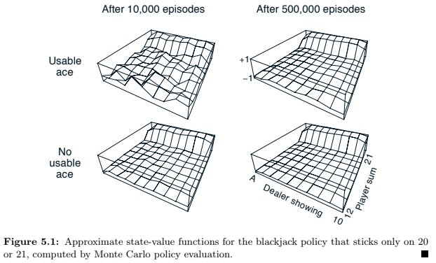
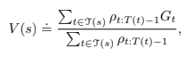
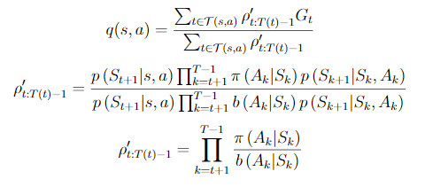
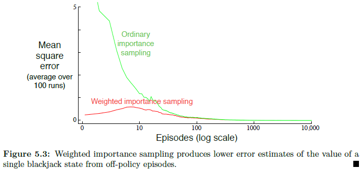
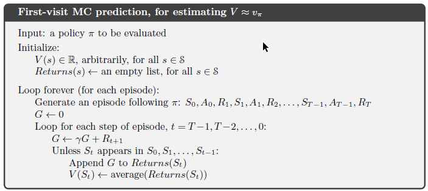
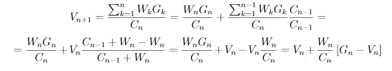
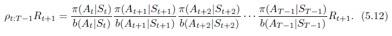
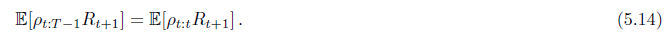
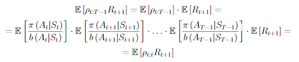

# Chapter 5

### Exercise 5.1

Consider the diagrams on the right in Figure 5.1. Why does the estimated
value function jump up for the last two rows in the rear? Why does it drop off for the
whole last row on the left? Why are the frontmost values higher in the upper diagrams
than in the lower?



#### Answer

The last two rows are for players 20 and 21. Thats the only two states player sticks to. There is a lot of chances that player gets bust when he has 18 or 19 nad getting one more card.
If player has 17 or less dealer needs to gets bust to let player wins.

Last row on the left means dealer has an ace so there is one more chance for dealer to count ace as 1 not as 11.

With usable ace on players hand there is one more chance for player to count ace as 1 not as 11 so there is less probability to gets bust by the player.

### Exercise 5.2

Suppose every-visit MC was used instead of first-visit MC on the blackjack task. Would you expect the results to be very different? Why or why not?

#### Answer

Visiting one state more than once within one episode is possible only by switching ace from 11 to 1. It is not very likely to happen so using every-visit MC shouldn't change result significantly.

### Exercise 5.3

What is the backup diagram for Monte Carlo estimation of qπ?

#### Answer

Backup diagram is the same as for estimating vπ but it starts in action element (black circle).

### Exercise 5.4

The pseudocode for Monte Carlo ES is ineffcient because, for each state–action pair, it maintains a list of all returns and repeatedly calculates their mean. It would be more effcient to use techniques similar to those explained in Section 2.4 to maintain
just the mean and a count (for each state–action pair) and update them incrementally.
Describe how the pseudocode would be altered to achieve this.

#### Answer

We can get average from all returns just keeping number of returns and last average. 
```
Qty(s,a)++
Q(s,a) = (Q(s,a)+Rt) * (Qty(s,a) - 1) / Qty(s,a)
```

### Exercise 5.5

Consider an MDP with a single nonterminal state and a single action
that transitions back to the nonterminal state with probability p and transitions to the
terminal state with probability 1-p. Let the reward be +1 on all transitions, and let γ = 1. Suppose you observe one episode that lasts 10 steps, with a return of 10. What are the first-visit and every-visit estimators of the value of the nonterminal state?

#### Answer

| step   	| 0 	| 1 	| 2 	| 3 	| 4 	| 5 	| 6 	| 7 	| 8 	| 9   	| 10 	|
|--------	|---	|---	|---	|---	|---	|---	|---	|---	|---	|:-----:	|:----:	|
| state  	| s 	| s 	| s 	| s 	| s 	| s 	| s 	| s 	| s 	| s   	| T  	|
| reward 	| 1 	| 1 	| 1 	| 1 	| 1 	| 1 	| 1 	| 1 	| 1 	| 1   	| -  	|
| action 	| p 	| p 	| p 	| p 	| p 	| p 	| p 	| p 	| p 	| 1-p 	| -  	|

##### First-visit

v(s) = 10 / 1 = 10

##### Every-visit

v(s) = (1 + 2 + 3 + ... + 10) / 10 = 5.5

### Exercise 5.6

What is the equation analogous to (5.6) for action values q(s, a) instead of state values v(s), again given returns generated using b?



#### Answer 



### Exercise 5.7

In learning curves such as those shown in Figure 5.3 error generally decreases with training, as indeed happened for the ordinary importance-sampling method. But for the weighted importance-sampling method error first increased and then decreased. Why do you think this happened?



#### Answer

TODO
Actions are choosen randomly and over some number of first steps and a lot of rewards are negative (-1). Over time number of episodes increases and most of actions from equiprobable policy has probability = 0 and that value is different from real value. Only after explore enough state and actions the mean is correc

### Exercise 5.8

The results with Example 5.5 and shown in Figure 5.4 used a first-visit MC
method. Suppose that instead an every-visit MC method was used on the same problem.
Would the variance of the estimator still be infinite? Why or why not?

#### Answer

Reward appears only at last step of episode so for every-visit MC method Gi = 1 and average is i*1 / i = 1  same as in first-visit method.

### Exercise 5.9

Modify the algorithm for first-visit MC policy evaluation (Section 5.1) to
use the incremental implementation for sample averages described in Section 2.4.



#### Answer

Instead of using (last 2 lines)
```
Append G to Returns(St)
V(St) <- average(Returns(St))
```
compute V(St) only from last V(St) value and counter N(A)
```
N(St) <- N(St) + 1
V(st) <- V(St) + 1/N(St) * [G - V(St)]
```
Don't forget to initialize 
```
N(st) = 0
```
at the beginning.

### Exercise 5.10

Derive the weighted-average update rule (5.8) from (5.7). Follow the
pattern of the derivation of the unweighted rule (2.3).

#### Answer



### Exercise 5.11

In the boxed algorithm for off-policy MC control, you may have been
expecting the W update to have involved the importance-sampling ratio π(At|St)/b(At|St), but
instead it involves 1/b(At|St) . Why is this nevertheless correct?

#### Answer 

POlicy π is greedy so probability of taking action At in state St is 1.

### Exercise 5.12

programming - skipped

### Exercise 5.13

Show the steps to derive (5.14) from (5.12).





#### Answer



_latex:_
```
\mathbb{E}\left[\rho_{t:T-1}R_{t+1}\right] = \mathbb{E}\left[\rho_{t:T-1}\right]\cdot\mathbb{E}\left[R_{t+1}\right] = 
= \mathbb{E}\left[\frac{\pi\left(A_t \middle| S_t\right)}{b\left(A_t \middle| S_t\right)}\right]
\cdot
\mathbb{E}\left[\frac{\pi\left(A_{t+1} \middle| S_{t+1}\right)}{b\left(A_{t+1} \middle| S_{t+1}\right)}\right]
\cdot \ldots \cdot
\mathbb{E}\left[\frac{\pi\left(A_{T-1} \middle| S_{T-1}\right)}{b\left(A_{T-1} \middle| S_{T-1}\right)}\right]
\cdot\mathbb{E}\left[R_{t+1}\right] =
= \mathbb{E}\left[\rho_{t:t}R_{t+1}\right]
```   
