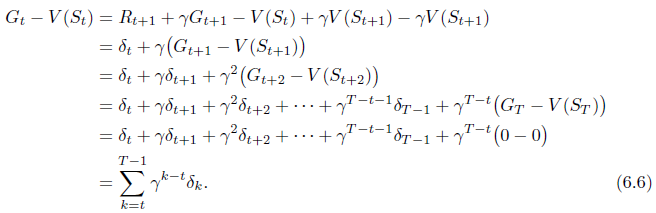
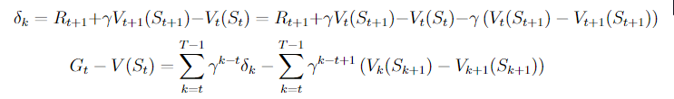

# Chapter 6

### Exercise 6.1

If V changes during the episode, then (6.6) only holds approximately; what would the difference be between the two sides? 
Let Vt denote the array of state values used at time t in the TD error (6.5) and in the TD update (6.2). 
Redo the derivation above to determine the additional amount that must be added to the sum of TD errors in order to equal the Monte Carlo error.

#### Answer

