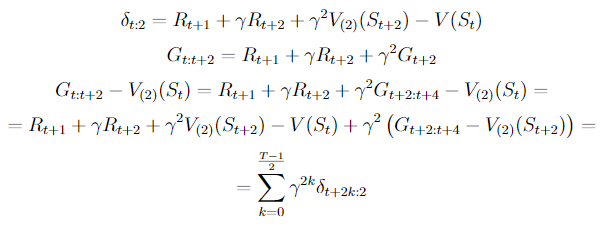
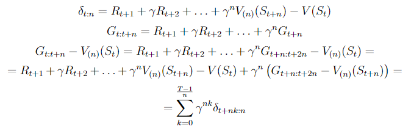
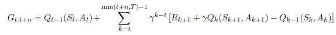
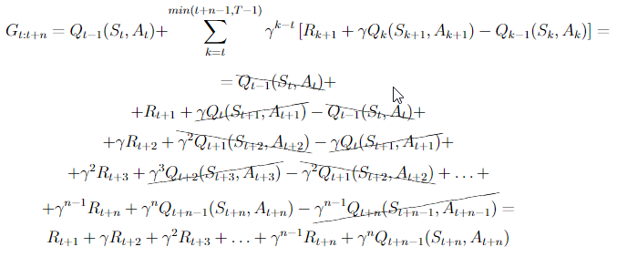

# Chapter 7

### Exercise 7.1

If V changes during the episode, then (6.6) only holds approximately; what would the difference be between the two sides? 
Let Vt denote the array of state values used at time t in the TD error (6.5) and in the TD update (6.2). 
Redo the derivation above to determine the additional amount that must be added to the sum of TD errors in order to equal the Monte Carlo error.

#### Answer

_for 2-step TD_



_latex:_

```
    \delta_{t:2} = R_{t+1} + \gamma R_{t+2} + \gamma^2 V_{(2)}(S_{t+2}) - V(S_t)
    G_{t:t+2} = R_{t+1} + \gamma R_{t+2} + \gamma^2G_{t+2}
    G_{t:t+2} - V_{(2)}(S_t) = R_{t+1} + \gamma R_{t+2} + \gamma^2 G_{t+2:t+4} - V_{(2)}(S_t) =
    = R_{t+1} + \gamma R_{t+2} + \gamma^2 V_{(2)}(S_{t+2}) - V(S_t) + \gamma^2 \left(G_{t+2:t+4} - V_{(2)}(S_{t+2})\right) = 
    = \sum_{k=0}^{\frac{T-1}{2}} \gamma^{2k} \delta_{t+2k:2}
```

_for n-step TD_



_latex:_

```
    \delta_{t:n} = R_{t+1} + \gamma R_{t+2} + \ldots + \gamma^n V_{(n)}(S_{t+n}) - V(S_t)
    G_{t:t+n} = R_{t+1} + \gamma R_{t+2} + \ldots + \gamma^nG_{t+n}
    G_{t:t+n} - V_{(n)}(S_t) = R_{t+1} + \gamma R_{t+2} + \ldots + \gamma^n G_{t+n:t+2n} - V_{(n)}(S_t) =
    = R_{t+1} + \gamma R_{t+2} + \ldots + \gamma^n V_{(n)}(S_{t+n}) - V(S_t) + \gamma^n \left(G_{t+n:t+2n} - V_{(n)}(S_{t+n})\right) = 
    = \sum_{k=0}^{\frac{T-1}{n}} \gamma^{nk} \delta_{t+nk:n}
```    

### Exercise 7.2

programming

### Exercise 7.3

Why do you think a larger random walk task (19 states instead of 5) was
used in the examples of this chapter? Would a smaller walk have shifted the advantage
to a different value of n? How about the change in left-side outcome from 0 to −1 made
in the larger walk? Do you think that made any di↵erence in the best value of n?

#### Answer 

Differences between different n and α would be smaller for 5 states than for 19 states.

5 states example can cause better value for smaller n than n=4.

If we change left-side reward to -1 and left initial value untouched the initial value will be more optimistic but it should minimized after first 10 episodes.

### Exercise 7.4
Prove that the n-step return of Sarsa (7.4) can be written exactly in terms
of a novel TD error, as



#### Answer


