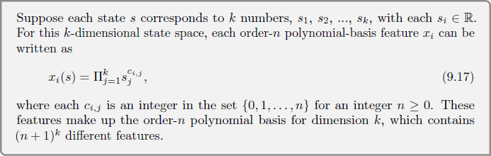

# Chapter 9

### Exercise 9.1

Show that tabular methods such as presented in Part I of this book are a
special case of linear function approximation. What would the feature vectors be?

#### Answer

Feature vector would be as long as number of states (|S|) with all zeros except one in only one place and weights are vector with |S| weights.

### Exercise 9.2

Why does (9.17) define (n + 1)^k distinct features for dimension k

#### Answer

There are (n+1) possible values of power (0,1,...,n) for each feature component s_j and there are k feature components (1,2,...,k).

In that combination, there are (n+1)^k possibilities.

For example, number with binary digits (0/1) which has 3 digits can have up to 8 (2^3) different numbers.

### Exercise 9.3

What n and ci,j produce the feature vectors x(s) = (1, s1, s2, s1s2, s12, s22, s1s22,  s12s2,  s12s22)T

#### Answer 

n = 2

c_i,j:

| i\j 	    | 1 	| 2 	| res xi(s) 	|
|----:	    |:-:	|:-:	|:--------:	|
|   **1** 	| 0 	| 0 	|     1    	|
|   **2** 	| 1 	| 0 	|     s1     	|
|   **3** 	| 0 	| 1 	|     s2     	|
|   **4** 	| 1 	| 1 	|     s1s2     	|
|   **5** 	| 2 	| 0 	|     s12     	|
|   **6** 	| 0 	| 2 	|     s22     	|
|   **7** 	| 1 	| 2 	|     s1s22     	|
|   **8** 	| 2 	| 1 	|     s12s2     	|
|   **9** 	| 2 	| 2 	|     s12s22     	|

### Exercise 9.4

Suppose we believe that one of two state dimensions is more likely to have
an effect on the value function than is the other, that generalization should be primarily
across this dimension rather than along it. What kind of tilings could be used to take
advantage of this prior knowledge?

#### Answer

In case of diagonal tiling splitting can be more across more meaningfull dimension than the others.
In general case we can choose smaller tailing width across that dimension and bigger tailing width across other dimensions to keep number of tiles small enough and minimize errors.

