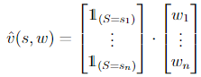

# Chapter 9

### Exercise 9.1

Show that tabular methods such as presented in Part I of this book are a
special case of linear function approximation. What would the feature vectors be?

#### Answer

Feature vector would be as long as number of states (|S|) with all zeros except one in only one place and weights are vector with |S| weights.

