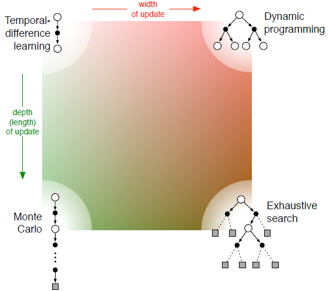

# Overview
## Basic exploration algorithms
### ε-greedy
### Optimistic Initial Values
### Upper-Confidence-Bound
### Gradient Bandit Algorithms
## Algorithms comparison

### Dimensions
*Definition of return*
Is the task episodic or continuing, discounted or undiscounted?
Action values vs. state values vs. afterstate values What kind of values should
be estimated? If only state values are estimated, then either a model or a separate
policy (as in actor–critic methods) is required for action selection.
Action selection/exploration How are actions selected to ensure a suitable trade-o↵
between exploration and exploitation? We have considered only the simplest ways to
do this: "-greedy, optimistic initialization of values, soft-max, and upper confidence
bound.
Synchronous vs. asynchronous Are the updates for all states performed simultaneously
or one by one in some order?
Real vs. simulated Should one update based on real experience or simulated experience?
If both, how much of each?
Location of updates What states or state–action pairs should be updated? Modelfree
methods can choose only among the states and state–action pairs actually
encountered, but model-based methods can choose arbitrarily. There are many
possibilities here.
Timing of updates Should updates be done as part of selecting actions, or only afterward?
Memory for updates How long should updated values be retained? Should they be
retained permanently, or only while computing an action selection, as in heuristic
search?
